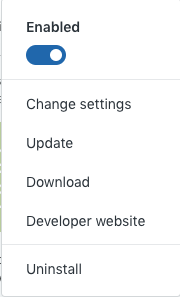
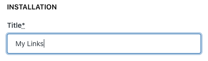
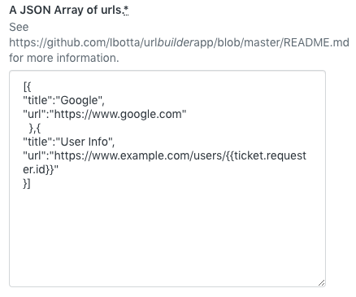
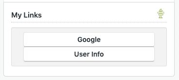
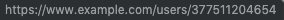

[](LICENSE)

# URL Builder App V2

## Description:

A Zendesk App to generate links for agents from Zendesk Chat visitor info

## Usage Instructions:
### Building
User the `build` and `package` scripts to generate a .zip file in `./dist/tmp/`

### Installing
1. Navigate to the Zendesk Marketplace and find "URL Builder App V2".
2. Click "Install".
3. Similarly, you can reach this screen by going to your installed apps, and clicking "Change Settings".



4. Select your account to install the app.
5. Confirm the title; this will display in the URL Builder App box above the links:



6. The second box is for the URLS, and uses an array of JSON, described below. In this example, note we are using a placeholder `{{visitor.id}}`.



7. Optionally enable role restrictions if these URLs are not appropriate for all agents.
8. Once your JSON is in place, click `Install`.
9. Open a new browser to test your results.



If we highlight the `User Info` link, we see the placeholder `visitor.id` has been replaced with the Zendesk end user's ID of `377511204654`.



## JSON Array of URLs:

The following is an example of what can be entered into this app's settings:

```javascript
[
  {
    "title": "First Title",
    "url": "http://example.com/?name={{visitor.name}}"
  }
]

```
This example will generate the following HTML inside the app:
```html
<ul>
  <li>
    <a href="http://example.com/?name=Robert C.Martin">First Title</a>
  </li>
</ul>
```
